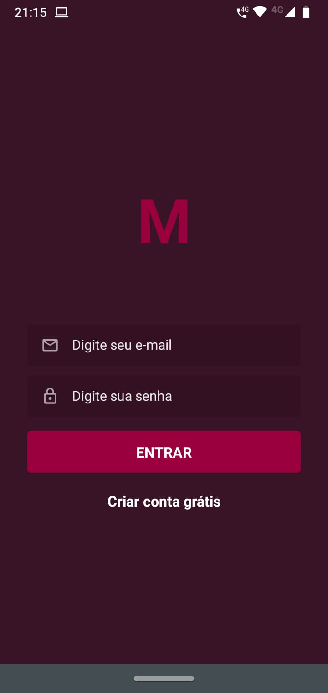
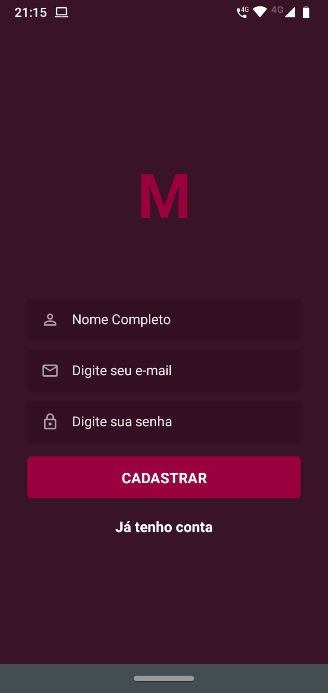
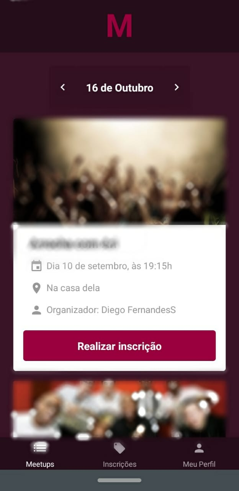
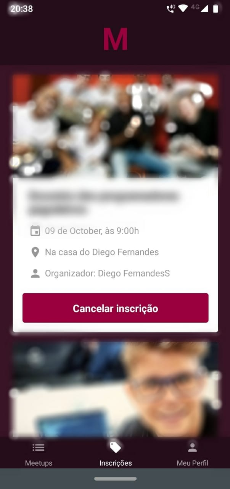

## MEETAPP MOBILE

- Styled-Components
- Icones
- Navegação SwitchNavigator / BottomTabNavigator
- Redux / Saga / Redux persist
- Reactotron
- date format com date-fns
- Cadastro de usuários;
- Tela de Login;
- Dashboard / Lista de Eventos (Meetups);
- Incrições / Eventos (Meetups) inscrito;
- Tela de edição do Perfil;

### Funcionalidades

- Na tela de dashboard ao clicar em cima do "Dia Mes" aparecerá um picker para selecionar o mês desejado para listar os eventos;
- Ao clicar nas arrows ao lado do "Dia Mês" irá avançar a página dos eventos, máximo de 10 eventos por página;
- Comunicação com servidor via Axios, não esquecer de mudar o IP do servidor;

### Login

### Cadastro

### Dashboard

### Inscrições

### Perfil

##### Apenas ANDROID
